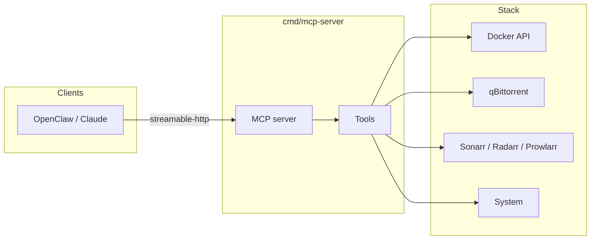

# Stoganet MCP

MCP server exposing ops tools for the Stoganet home server. Gives AI agents (OpenClaw/Claude) structured access to Docker, the *arr stack, qBittorrent, and system health.

Licensed under [MIT](./LICENSE).

## Architecture

Stateless Go binary. Deployed as a Docker container on the `internal` compose network alongside the rest of the Stoganet stack. OpenClaw connects via streamable-http transport.



## Tools

| Tool | Status | Description |
|------|--------|-------------|
| `ping` | ✅ | Health check — verifies MCP handshake |
| Docker tools | 🔜 | Container status, restart, logs |
| qBittorrent tools | 🔜 | Download queue, add/remove torrents |
| Arr tools | 🔜 | Sonarr/Radarr/Prowlarr management |
| System health | 🔜 | Disk, CPU, VPN status |

## Environment variables

| Variable | Default | Description |
|---|---|---|
| `LISTEN_ADDR` | `:8080` | HTTP listen address |
| `MCP_SERVER_NAME` | `stoganet-mcp` | Name advertised in MCP handshake |
| `MCP_SERVER_VERSION` | `dev` | Version string; overridden via build ldflags in CI |

## Development

```sh
make test     # run all tests with -race
make lint     # golangci-lint
make build    # compile to dist/mcp-server
make tidy     # go mod tidy
```

## OpenClaw config

```json5
{
  mcp: {
    servers: {
      stoganet: {
        url: "http://mcp-server:8080/mcp",
        transport: "streamable-http"
      }
    }
  }
}
```

## Repository layout

| Path | What's there |
|------|-------------|
| [`cmd/mcp-server/`](./cmd/mcp-server) | Binary entrypoint: config, wiring, graceful shutdown |
| [`internal/config/`](./internal/config) | Env-based config loader |
| [`internal/server/`](./internal/server) | MCP server construction and tool registration |
| [`internal/tools/`](./internal/tools) | Tool implementations, one file per domain |
